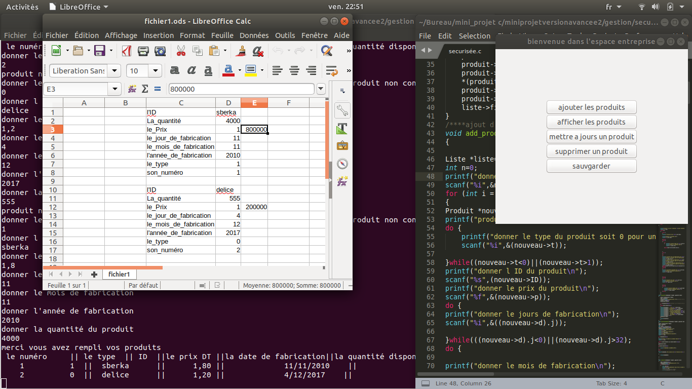

# C-MiniProject-inventory-Management
1st year c project inventory Management  
Powered with a GUI using the GTK GNU/LINUX library 

The system has different features needed for better inventory management. The application must perform the following treatments: 
1) Adding a product using the function:  void add_produit(GtkWidget *widget ,gpointer data) 
2) modifying a product using the function:  void maj(GtkWidget *widget , gpointer data) 
3) deleting a product using the function:  void delete(GtkWidget *widget , gpointer data) 
void delete_first(Liste *liste) 
void delete_n(Liste *liste,int n)
4) displaying a product using the function:  
void afficher_liste(GtkWidget *widget ,gpointer data) 
5) saving to an excel file using the function: 
void sauvgarder(GtkWidget *widget ,gpointer data)  
6) order and comment specific to the customer using the function:
void ajouteramonpanier(GtkWidget *widget ,gpointer data) 
void commenter(GtkWidget *widget ,gpointer data)

